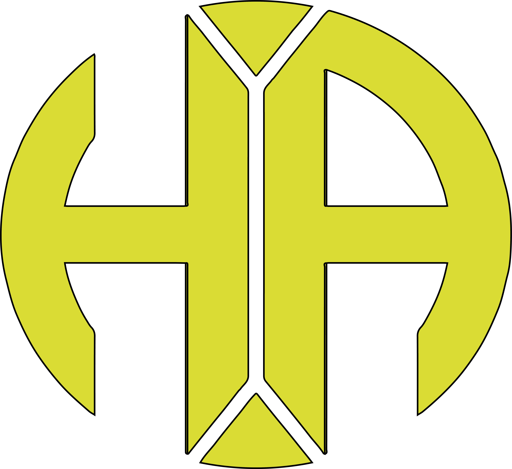

<!-- abd0hrz -->

# Harizi B Abdellah - Abd0hrz

I'm Full Stack software developer/DevOps & Cloud engineer with a passion for DevSecOps activities and easily adapt to different posts depending on what the project requires. I love exploring new tech stack 💻 and leveraging them to build cool stuffs 🛠️.
 
 

### 🧐 More About Me:

- 🔭&nbsp; I’m currently working on **Freelancer**
- 🌱&nbsp; I’m currently learning more about DevSecOps 
- 👨🏻‍💻&nbsp; Most of my projects are available on [Github](https://github.com/rahul-jha98?tab=repositories)

- 📫&nbsp; Feel free to ping me on [LinkedIn](https://www.linkedin.com/in/harizi-bouabdellah/)
- 📝&nbsp; Checkout my [resume](https://drive.google.com/file/d/1ZpR5pVBTnl_Qybq7GE3MGy1SB1JehVdSE/view?usp=sharing)
- 📚&nbsp; When I am free, I read books. Checkout my favourite books on [Goodreads](https://www.goodreads.com/user/show/147198181-harizi-abdellah) 
- 😻&nbsp; Moreover, I'm a cat lover (｡◕‿‿◕｡) 

 

## About me

## 🛠 Technologies & Tools

<!-- https://simpleicons.org/ -->

&nbsp;

&nbsp;

&nbsp;

&nbsp;

&nbsp;

&nbsp;

&nbsp;

&nbsp;

&nbsp;

&nbsp;

&nbsp;

&nbsp;

&nbsp;

&nbsp;

&nbsp;

&nbsp;

&nbsp;

&nbsp;

&nbsp;

&nbsp;

&nbsp;

&nbsp;

## &#x270d; Blog & Writing

Apart from coding, I also maintain a blog - you can find my articles on [my personal website](https://www.abd0hrz.com/blog/) as well as on [Medium](https://medium.com/@abd0hrz)

A sample of my recent articles:

<!-- BLOG-POST-LIST:START -->
- [Backup-and-Restore of Containers with Kubernetes Checkpointing API](https://martinheinz.dev/blog/85)
- [Getting Started with Google APIs in Python](https://martinheinz.dev/blog/84)
- [Python CLI Tricks That Don&#39;t Require Any Code Whatsoever](https://martinheinz.dev/blog/83)
- [All The Ways To Introspect Python Objects at Runtime](https://martinheinz.dev/blog/82)
<!-- BLOG-POST-LIST:END -->

 
<h2 align="center">🔥 GitHub Stats 🔥</h2>
<!-- https://github.com/anuraghazra/github-readme-stats -->
 

  
  

 
<h2 align="center"> Get in touch </h2>
 
<!-- https://icons8.com -->

  
  
  

 

<h3 align="center">📑 MY FRIEND has a message for you... 📑</h3>

 

  

 

